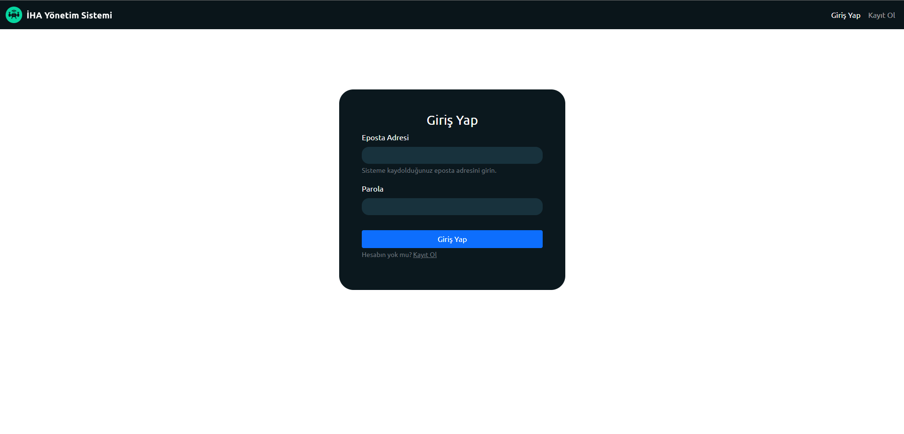
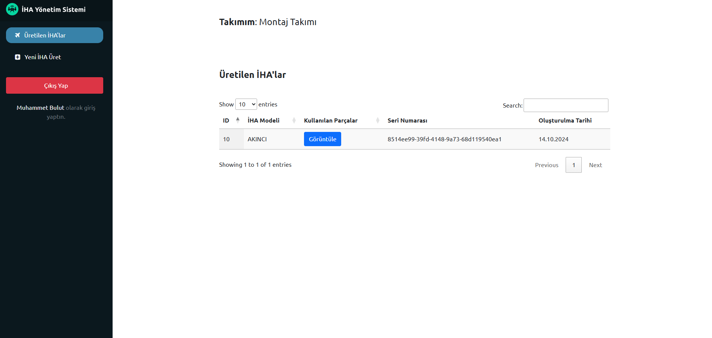
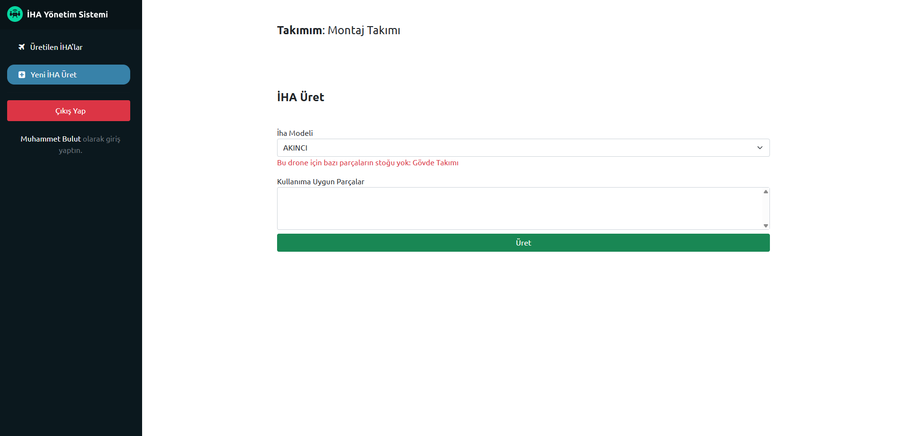
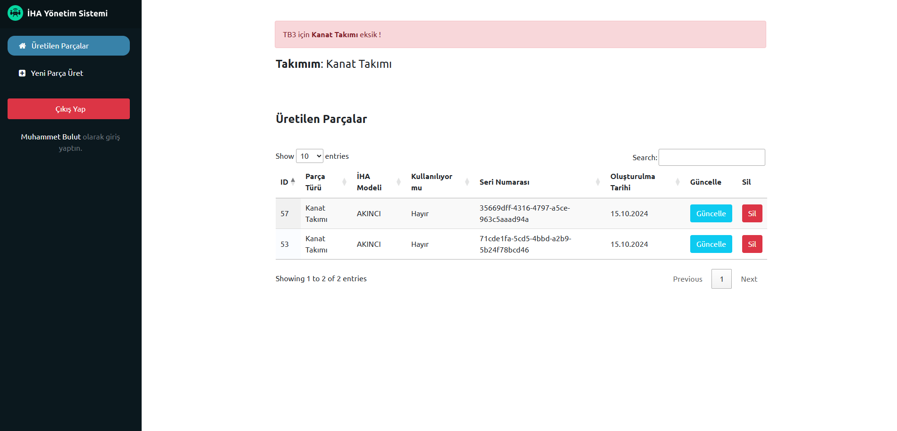

# Baykar Case / İHA Yönetim Sistemi

Bu belge, URL örnekleri, testleri çalıştırma yönergeleri ve Docker kullanarak projeyi kurma adımları dahil olmak üzere proje için teknik belgeler sağlar.

# Proje Demosu

Projenin canlı demosuna aşağıdaki adresten erişilebilir

https://mbulut.pythonanywhere.com/

# API Dökümantasyonu

https://mbulut.pythonanywhere.com/swagger/

# Proje bilgisi

Projeye ilgili sayfaları aşağıdaki endpointlerden takip edebilirsiniz. Proje içerisinde html yanıtlar dönen endpointlerle beraber 
JsonResponse dönen Django Rest Framework de kullanılmıştır. Bu sayede API başka istemcilerle de kullanılabilir

Kullanılan teknolojiler; <br>
- Django
- Django Rest Framework
- Django Filters
- Bootstrap
- Datatable.js
- JQuery / AJAX

### Proje içerisinden örnek ekran görüntüleri








### Django Rest Framework ile API endpointleri;

#### Accounts
- `POST` `/api/accounts/login` giriş 
- `POST` `/api/accounts/register` kayıt olma
- `GET` `/api/teams/` takımların listesi (kayıt olurken seçilmesi için)

#### Drones
- `GET` `/api/drone/` İHA Türlerinin listesi
- `GET` `/api/drone/items` Üretilen İHA'lar (Sadece montaj takımı erişebilir)
- `GET` `PUT` `DELETE` `/api/drone/items/<int:pk>/` Üretilen İHA 
- `POST`  `/api/drone/assemble/` Parçalarla İHA üret (O İHA için tüm parçaların mevcut olması gerekir) (Sadece montaj takımı erişebilir)
- `POST` `GET` `/api/drone/assembly-stock-check/` İlgili takım için veya drone için stok kontrolü 
- `POST` `GET` `/api/drone/parts/` Parçalar için listeleme ve oluşturma endpointi
- `GET` `PUT` `DELETE` `/api/drone/parts/` Parçalar için CRUD endpointi


# Projeyi ayağa kaldırmak

### Proje ayağa kaldırma işleminden sonra admin panelinden drone eklenmelidir. 


## Docker ile
   ```shell
 docker-compose up
 ```

## Manuel

Manuel kullanımda settings.py içerisinde yorum satırına alınmış sqlite yapılandırması seçilmeli. PostgreSQL docker kullanırken seçilmeli.

1. Gereklilikleri yükleme
     ```shell
     pip install -r requirements.txt 
     ``` 
2. Migrate işlemi
    ```shell
     python manage.py migrate
     ``` 
3. Projeyi başlatma
    ```shell
     python manage.py runserver
      ```

### Testler:
   ```shell
   python manage.py test
```

### Admin Kullanıcı Oluşturma:
   ```shell
   python manage.py createsuperuser
```

